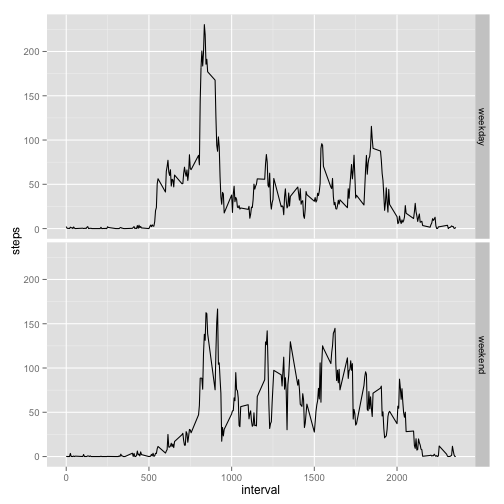

# Reproducible Research: Peer Assessment 1


## Loading and preprocessing the data

```r
data <- read.csv("activity.csv")
data$date <- as.Date(data$date, "%Y-%m-%d")
```


## What is mean total number of steps taken per day?

To analyse the total number of steps, we first sum all steps per day (omitting any missing values in the process).

```r
total.steps.per.day <- aggregate(steps ~ date, data, sum)
```

The histogram of the steps is shown below.

 

The summary statistics including the *mean* and *median* are shown below.


```
##    Min. 1st Qu.  Median    Mean 3rd Qu.    Max. 
##      41    8840   10800   10800   13300   21200
```
## What is the average daily activity pattern?
To examine the daily activity pattern, we first calculate the mean for each interval.


```r
avg.steps.per.interval <- aggregate( steps ~ interval, data, mean)
```
The diagram below shows the time series.

 

On average across all the days in the dataset, the maximum number of steps is contained in interval 835, which contains 206.2 steps).

## Imputing missing values

The data set contains 2304 missing values, or 13.1148 percent. We will imput these missing values by the average for the interval across all days.


```r
data.imputed <- merge(data, avg.steps.per.interval, by="interval")
names(data.imputed) <- c("interval", "steps", "date", "mean")
data.imputed$steps[is.na(data.imputed$steps)] <- data.imputed$mean[is.na(data.imputed$steps)]
```

Below is the histogram, with the imputed data.

 

The summary statistics including the *mean* and *median* are shown below.


```
##    Min. 1st Qu.  Median    Mean 3rd Qu.    Max. 
##      41    9820   10800   10800   12800   21200
```

This shows that there is hardly any impact on the analysis of number of steps taken per day.

## Are there differences in activity patterns between weekdays and weekends?

To assess if there are difference between weekdays and weekends, we create a new factor variable in the dataset with two levels – “weekday” and “weekend” indicating whether a given date is a weekday or weekend day. We use the data set with imputed data.


```r
data.imputed$type.day <- "weekday"
we <- c("Saturday", "Sunday")
data.imputed$type.day[weekdays(data.imputed$date) %in% we] <- "weekend"
data.imputed$type.day <- factor(data.imputed$type.day)
```

Below we show the activity patterns for weekdays and weekends.


```r
d <- aggregate(steps ~ interval * type.day, data.imputed, mean)
ggplot(d, aes(x=interval, y=steps)) + geom_line() + facet_grid(type.day ~ .)
```

 
